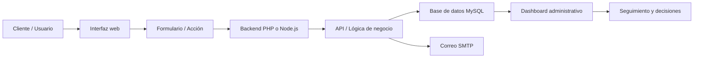

<h1 align="center">⚙️ Nubira Web Stack Showcase</h1>

  <strong>Presentación técnica de stack Full Stack, APIs, dashboards y sistemas web desarrollados por Nubira Web</strong>

  React · Node.js · APIs REST · PHP · MySQL · SMTP · Dashboards · Paneles administrativos

  
  
  

  
  
  
  
  
  
  

---

## ✨ Vista general

**Nubira Web Stack Showcase** presenta las capacidades técnicas que pueden integrarse en proyectos más avanzados: interfaces modernas, APIs, dashboards, bases de datos, automatizaciones y paneles administrativos.

Este showcase complementa el portafolio comercial de Nubira Web mostrando que una solución puede ir más allá de una página web estática y convertirse en un sistema operativo para negocios.

  <strong>Diseño visual + lógica de negocio + datos + automatización + administración.</strong>

---

## 🎯 Objetivo del showcase

El objetivo es demostrar una visión Full Stack aplicada a proyectos reales y escalables.

<table>
  <tr>
    <td><strong>⚛️ Interfaces modernas</strong></td>
    <td>Componentes dinámicos, dashboards y experiencias interactivas con React.</td>
  </tr>
  <tr>
    <td><strong>🟢 Backend con APIs</strong></td>
    <td>Endpoints preparados para conectar formularios, paneles, métricas y módulos internos.</td>
  </tr>
  <tr>
    <td><strong>🗄️ Base de datos</strong></td>
    <td>Almacenamiento de clientes, leads, reservas, servicios, estados y solicitudes.</td>
  </tr>
  <tr>
    <td><strong>📩 Automatización</strong></td>
    <td>Correos automáticos, confirmaciones, avisos internos y seguimiento.</td>
  </tr>
</table>

---

## 🧠 Arquitectura conceptual

---

## 🧩 Módulos que puede incluir una solución

<table>
  <tr>
    <td align="center"><strong>Frontend</strong> Interfaz responsive y componentes visuales</td>
    <td align="center"><strong>Backend</strong> Lógica de negocio y validaciones</td>
    <td align="center"><strong>Base de datos</strong> Datos organizados y consultables</td>
  </tr>
  <tr>
    <td align="center"><strong>API</strong> Comunicación entre módulos</td>
    <td align="center"><strong>Dashboard</strong> Panel de control interno</td>
    <td align="center"><strong>Automatización</strong> Correos, avisos y flujos</td>
  </tr>
</table>

---

## 🛠️ Stack técnico presentado

| Área | Tecnologías / Capacidades |
|---|---|
| **Frontend** | HTML5, CSS3, JavaScript, React |
| **Backend** | PHP, Node.js, lógica de negocio |
| **Base de datos** | MySQL |
| **APIs** | Endpoints REST, JSON, conexión entre módulos |
| **Automatización** | SMTP, correos automáticos, confirmaciones |
| **Administración** | Dashboards, filtros, estados, exportación |
| **Hosting** | cPanel, dominios, estructura de producción |
| **Versionado** | GitHub, repositorios privados, releases y backups |

---

## 📊 Ejemplo de dashboard

La sección Stack Avanzado muestra una demo visual tipo dashboard para representar cómo una empresa podría revisar leads, solicitudes, estados, métricas y procesos desde una interfaz moderna.

🔗 **Ver demo técnica:**  
https://nubiraweb.com/stack-avanzado.php

---

## 💼 Qué demuestra este showcase

| Capacidad | Demostración |
|---|---|
| **Full Stack real** | Conexión entre interfaz, backend, base de datos y paneles internos. |
| **Pensamiento de sistema** | Soluciones que no solo muestran información, también gestionan procesos. |
| **Escalabilidad** | Posibilidad de crecer hacia APIs, dashboards y módulos avanzados. |
| **Automatización** | Correos, estados, seguimiento y flujos comerciales. |
| **Presentación profesional** | Capacidad de explicar técnicamente el valor del proyecto sin exponer código privado. |

---

## 🚀 Aplicaciones posibles

Este tipo de stack puede aplicarse en:

- sistemas de reservas
- CRM para leads
- paneles administrativos
- catálogos con cotización
- dashboards de métricas
- sistemas de órdenes
- portales internos
- formularios inteligentes
- automatización de correos
- módulos conectados por API

---

## 🔗 Enlaces importantes

| Recurso | Enlace |
|---|---|
| **Stack avanzado** |  |
| **Nubira Web** |  |
| **Iniciar proyecto** |  |

---

## 🚀 Sobre Nubira Web

  <strong>Nubira Web crea sitios y sistemas web para negocios que necesitan verse profesionales y operar mejor.</strong>

  
  

---

  <strong>Nubira Web Stack Showcase · React, Node.js, APIs, PHP, MySQL y sistemas web funcionales</strong>

